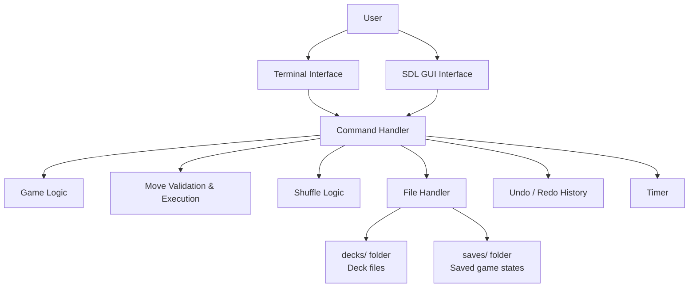
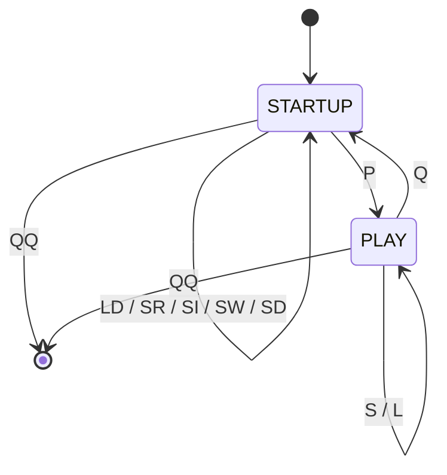
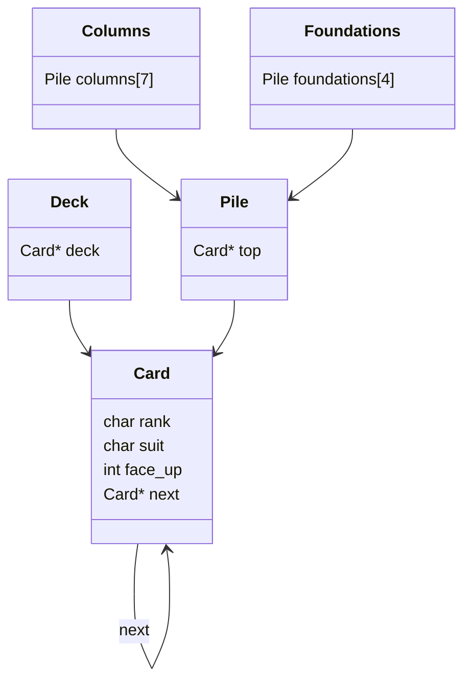
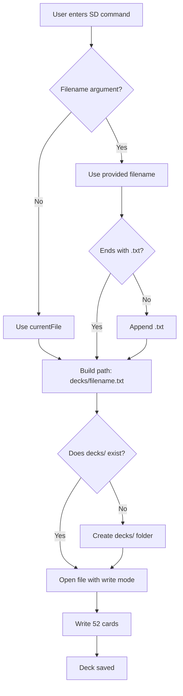
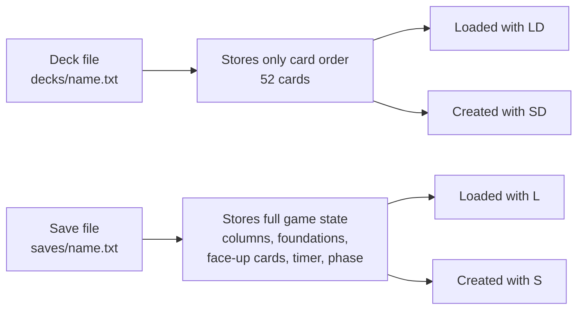
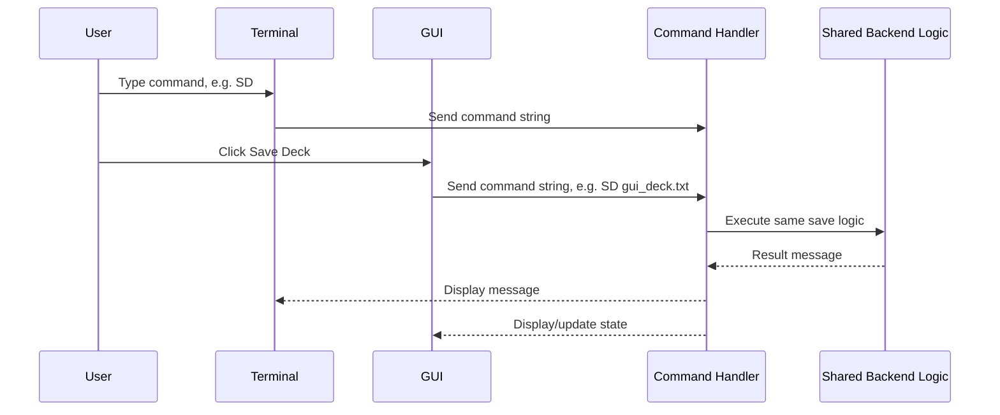

# Yukon Design Diagrams

## Figure 1: Overall Architecture

## Figure 2: Game Phase Design

## Figure 3: Data Structure Design

## Figure 4: Deck Save Design

## Figure 5: Deck File vs Save File

## Figure 6: Shared Backend Between Terminal and GUI

